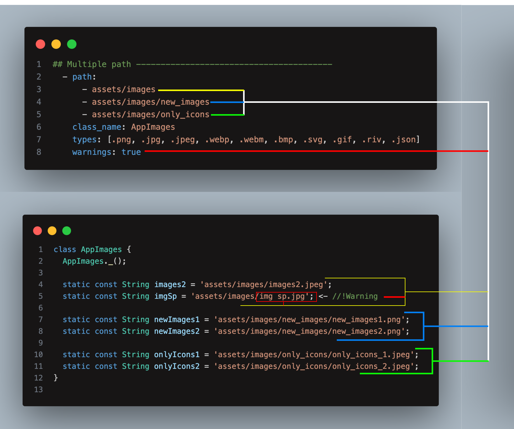

# Generator README

<div align="center">
  <h1>Simple generate Image</h1>
</div>


## Generator

- Create File ->  simpler_generator_images.yaml

`Generator default types [.png, .jpg, .jpeg, .webp, .webm, .bmp, .svg, .gif, .riv, .json]`


### `Single Path` --- ✅
```yaml
# **************************************************************************
# * ImagesGenerator - Simpler FLutter Generator - Enjoy bro 😜👍
# **************************************************************************

outputPath: lib/core/constant

groups:
  - path: assets/images
    class_name: AppImages
    types: [.png, .jpg, .jpeg, .webp, .webm, .bmp, .svg, .gif, .riv, .json]
    warnings: true

  # - path: assets/svg
  #   class_name: AppSvg
  #   types: [.svg]
  #   warnings: true

```

### `Multiple path` --- ✅

```yaml

# **************************************************************************
# * ImagesGenerator - Simpler FLutter Generator - Enjoy bro 😜👍
# **************************************************************************

outputPath: lib/core/constant

groups:
  - path:
      - assets/images
      - assets/images/new_images
      - assets/images/only_icons
    class_name: AppImages
    types: [.png, .jpg, .jpeg, .webp, .webm, .bmp, .svg, .gif, .riv, .json]
    warnings: true

  # - path: 
  #     - assets/svg
  #     - assets/svg/new_svg
  #   class_name: AppSvg
  #   types: [.svg]
  #   warnings: true
    

```

### Generate Folders

<div align="center">
  <h1>Simple generate Image</h1>
</div>


```json 
"SimplerFlutterGenerator.Generator": "equatable"
```
- Create Architecture ->  simpler_generator_folders.yaml

`Generator Folders`

```yaml

# **************************************************************************
# * ArchitectureGenerator - Simpler FLutter Generator -
# **************************************************************************

#? --> For Info
# showInputBox replacing 
# For Example:
#
#---> NAME
#
#   - writing "settings" to showInputBox
#
#   - before -> settings
#        - NAME_page.dart
#        - NAME_bloc.dart
#        - NAME_repository.dart
#
#   - after -> 
#        - settings_page.dart
#        - settings_bloc.dart
#        - settings_repository.dart
#
#
#---> LOWER_CASE
#
#   - before -> pay_login
#       - part 'LOWER_CASE_model.freezed.dart';
#       - part 'LOWER_CASE_model.g.dart';
#
#   - after ->
#       - part 'pay_login_model.freezed.dart';
#       - part 'pay_login_model.g.dart';
# 
# 
#---> to use Custom Dart Code
#   - should paste to false
#       - dataSource
#       - dataModels
#       - dataRepository
#       - entityModels
#       - domainRepository
#       - usecase
#       - stateWidget
# 

# ********************* Created Extension For Fun 😜 ************************


dataSource: false

dataModel: false

dataRepository: false

entityModel: false

domainRepository: false

usecase: false

blocType: equatable
#* equatable
#* simpleBloc
#* freezedBloc
#* Empty

stateWidget: StateFullWidget
#* StateFullWidget
#* StateLessWidget
#* Empty

# ----M.V.P-------------------------------------------------------> start
generate:
# ---Data------------------------------------------------------
  - category: data
    contents:
      - folder: data_source
        contents:
          - file: NAME_local_data_source.dart
          - file: NAME_remote_data_source.dart
      - folder: models
        contents:
          - file: NAME_model.dart
      - folder: repositories
        contents:
          - file: NAME_repository_impl.dart
# ---Domain----------------------------------------------------          
  - category: domain
    contents:
      - folder: entities
        contents:
          - file: NAME_entity.dart
      - folder: repositories
        contents:
          - file: NAME_repository.dart
      - folder: usecase
        contents:
          - file: NAME_usecase.dart
# ---Presentation----------------------------------------------
  - category: presentation
    contents:
      - folder: widgets
      - folder: bloc
        contents:
          - file: NAME_bloc.dart
          - file: NAME_event.dart
          - file: NAME_state.dart
      - folder: pages
        contents:
          - file: NAME_page.dart
# ------------------------------------------------------------- end

```
### `Generator Folders With Custom Dart Code`

```yaml

# **************************************************************************
# * ArchitectureGenerator - Simpler FLutter Generator -
# **************************************************************************

#? --> For Info
# showInputBox replacing 
# For Example:
#
#---> NAME
#
#   - writing "settings" to showInputBox
#
#   - before -> settings
#        - NAME_page.dart
#        - NAME_bloc.dart
#        - NAME_repository.dart
#
#   - after -> 
#        - settings_page.dart
#        - settings_bloc.dart
#        - settings_repository.dart
#
#
#---> LOWER_CASE
#
#   - before -> pay_login
#       - part 'LOWER_CASE_model.freezed.dart';
#       - part 'LOWER_CASE_model.g.dart';
#
#   - after ->
#       - part 'pay_login_model.freezed.dart';
#       - part 'pay_login_model.g.dart';
# 
# 
#---> to use Custom Dart Code
#   - should paste to false
#       - dataSource
#       - dataModels
#       - dataRepository
#       - entityModels
#       - domainRepository
#       - usecase
#       - stateWidget
# 

# ********************* Created Extension For Fun 😜 ************************


dataSource: false

dataModel: false

dataRepository: false

entityModel: false

domainRepository: false

usecase: false

blocType: equatable
#* equatable
#* simpleBloc
#* freezedBloc
#* Empty

stateWidget: StateFullWidget
#* StateFullWidget
#* StateLessWidget
#* Empty

# ----M.V.P-------------------------------------------------------> start
generate:
# ---Data------------------------------------------------------
  - category: data
    contents:
      - folder: data_source
        contents:
          - file: NAME_local_data_source.dart
          - file: NAME_remote_data_source.dart
      - folder: models
        contents:
          - file: NAME_model.dart
      - folder: repositories
        contents:
          - file: NAME_repository_impl.dart
# ---Domain----------------------------------------------------          
  - category: domain
    contents:
      - folder: entities
        contents:
          - file: NAME_entity.dart
            code: | 
              class NAMEEntity {}
      - folder: repositories
        contents:
          - file: NAME_repository.dart
            code: | 
              class NAMERepository {}
      - folder: usecase
        contents:
          - file: NAME_usecase.dart
            code: | 
              class NAMEUseCase {}
# ---Presentation----------------------------------------------
  - category: presentation
    contents:
      - folder: widgets
      - folder: bloc
        contents:
          - file: NAME_bloc.dart
          - file: NAME_event.dart
          - file: NAME_state.dart
      - folder: pages
        contents:
          - file: NAME_page.dart
            code: |
              import 'package:flutter/material.dart';

              class NAMEPage extends StatefulWidget {
                  const NAMEPage({super.key});
                  @override
                  State<NAMEPage> createState() => _NAMEPageState();
              }// now Eldiyar

              class _NAMEPageState extends State<NAMEPage> {
                @override
                Widget build(BuildContext context) {
                  return Scaffold(
                    appBar: AppBar(
                      title: const Text('NAMEPage'),
                    ),
                    body: Column(
                      children: [
                        Container(),
                      ],
                    ),
                  );
                }
              }
        
# ------------------------------------------------------------- end


```

### 1.1.7

 - Upgraded Folder Generator 🔥
    - folder: pages
        contents:
          - file: NAME_page.dart
            code: |
              ......dart code......
              ......dart code......
              ......dart code......

 make sure that starting from d of code:

### 1.1.6

 - Upgraded Assets Generator 🔥
    - Added Multiple path ✅
    - Optimized generating from single path ✅

### 1.1.4-5

 - Added dart codes 😅 🧰
    - dataSource: ✅ 
    - dataModel: ✅
    - dataRepository: ✅
    - entityModel: ✅
    - domainRepository: ✅
    - usecase: ✅
    - blocType: ✅
    - stateWidget: ✅

### 1.1.3 

 - Generate From Yaml File 🔥

### 1.0.0

 - Generate Assets 🔥 
 - Create Folders 🔥

### 0.0.1

Initial

---

## Reference to other extensions

[Simpler Flutter Snippet](https://marketplace.visualstudio.com/items?itemName=Eldiyar-Dev.simpler-flutter-snippets)<br>
[Simpler Flutter Tasks](https://marketplace.visualstudio.com/items?itemName=Eldiyar-Dev.simpler-flutter-tasks)


## Requirements

Vscode: ^1.82.0


**Enjoy!** 😁
